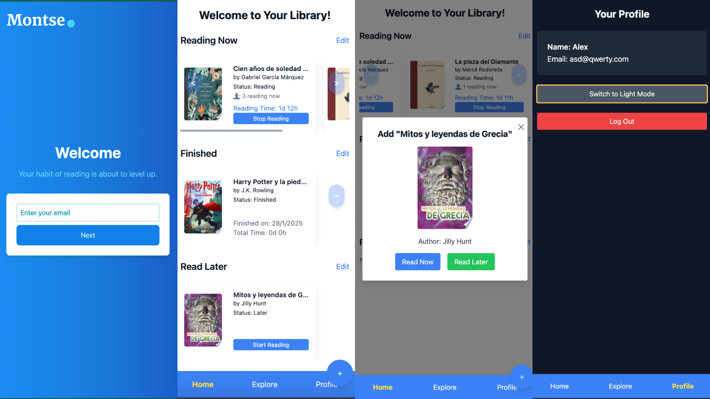

# Montse to improve reading habbit and personal grow

## Description

This application is your personal reading tracker. It helps you monitor your reading habits, stay motivated, and see your progress over time. Reading not only enhances your personal development but also strengthens memory, and fosters deeper neural connections.



Simply add a book you’re reading and take control of your progress. Track the days and hours you spend reading, stay engaged, and achieve your reading goals with ease!

  ## Features

- 📚 **Track Your Reading** – Monitor the books you’re reading, track your progress, and see how much time you spend on each book.  
- 🔍 **Search for Books** – Find books through the integrated Google Books API and add them to your reading list.  
- ✍️ **Add Books Manually** – If a book is not found in the database, you can enter its details manually.  
- 🎯 **Set and Track Goals** – Define your reading goals and track your progress with an interactive progress bar.  
- 📊 **Explore Your Statistics** – View insights into your reading habits by filtering books by week, month, or year.  
- 🏆 **Reading Status Management** – Organize books into categories: Reading Now, Read Later, and Finished.  
- 🌚 **Dark Mode Support** – Seamlessly switch between light and dark mode for a comfortable reading experience.  
- 🔄 **Sync Across Devices** – All data is securely stored in Firebase Firestore, ensuring seamless synchronization across devices.  
- 🗑️ **Manage Your Library** – Edit or remove books from your collection effortlessly.  

  ## **Technologies Used**

### **Frontend**
- **React** – Core library for building the UI  
- **Vite** – Fast development server and build tool  
- **TypeScript** – Static typing for better code quality  
- **Tailwind CSS** – Utility-first CSS framework  
- **React Router DOM** – Navigation and routing for React applications  
- **React Icons** – Icon library for UI enhancement  
- **Tailwind Scrollbar** – Custom styling for scrollbars  

### **State Management**
- **Redux Toolkit** – Efficient state management  
- **React Redux** – Integration of Redux with React  

### **Backend & Database**
- **Firebase** – Backend-as-a-service for authentication, Firestore database, and storage  
- **Date-fns** – Library for date manipulation  

## **Installation**

### **1. Clone the repository**  
Clone the project to your local machine:  

```bash
git clone https://github.com/Aleksei-Che/montse-app.git
```

### **2. Install dependencies**

Navigate to the project root and run:

```bash
npm install
```
### **3. Configure the .env file**
Create a .env file in the root directory and add the following environment variables:

```env
VITE_FIREBASE_API_KEY=your-api-key
VITE_FIREBASE_AUTH_DOMAIN=your-auth-domain
VITE_FIREBASE_PROJECT_ID=your-project-id
VITE_FIREBASE_STORAGE_BUCKET=your-storage-bucket
VITE_FIREBASE_MESSAGING_SENDER_ID=your-messaging-sender-id
VITE_FIREBASE_APP_ID=your-app-id
```

### **4. Run the development server**
To start the development environment, use:
```bash
npm run dev
```
Then, open http://localhost:5173 in your browser to see the application in action.

## **Deployment to Production**

### Vercel

To deploy the application on Vercel:
	1.	Ensure the environment configuration is correctly set up in Vercel.
	2.	In the terminal, navigate to the project root and run:

  ```bash
  vercel --prod
  ```
  This will deploy the application to a production environment on Vercel.

## **API**  
Montse App does not currently use a custom backend API. Instead, it relies on **Firebase Firestore** for data storage and synchronization. Below are the main functionalities handled through Firebase:  

- **User Authentication** – Firebase Authentication manages user sign-in and sign-out.  
- **Books Collection** – Firestore stores book data, including title, author, reading progress, and timestamps.  
- **Real-Time Synchronization** – Changes in book status (Reading Now, Read Later, Finished) are instantly updated across devices.  

---

## **Contributions**  
If you would like to contribute to the project, please follow these steps:  

1. **Fork the repository.**  
2. **Create a new branch** for your changes.  
3. **Commit your changes** with a clear and descriptive message.  
4. **Submit a pull request (PR)** with a detailed explanation of your changes.  

We appreciate all contributions that help improve Montse App! 🚀  

---

## **License**  
This project is licensed under the **MIT License**.
